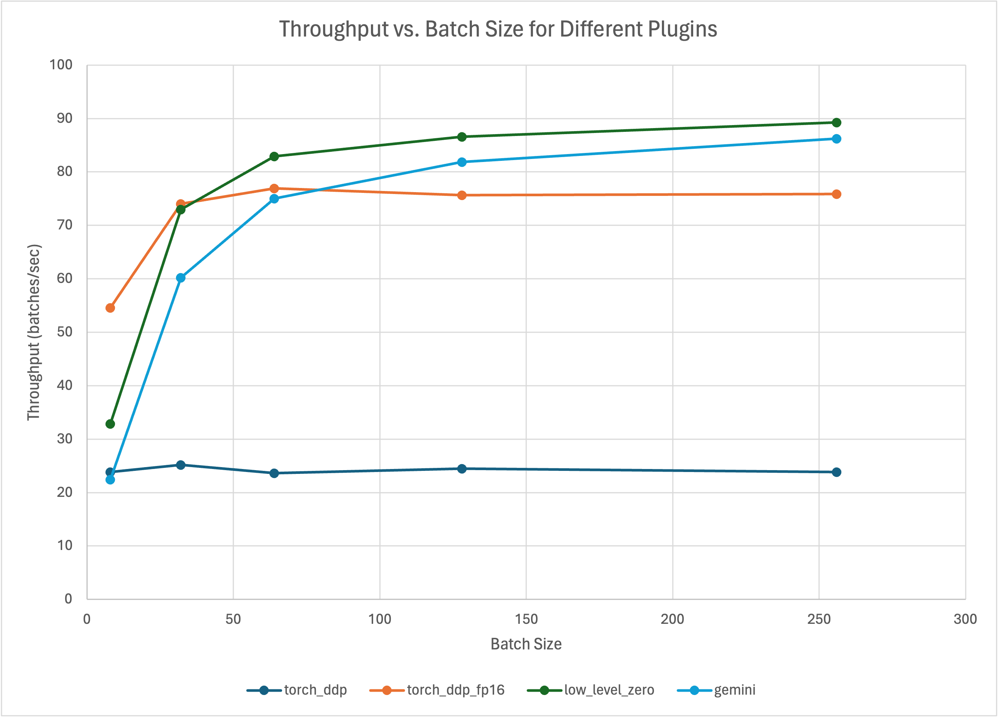

- [Overview](#overview)
   * [Dataset](#dataset)
   * [Experimental Setup](#experiment_setup)
   * [Experiment and Results](#experiment-and-results)
   * [Resources](#resources)

<!-- TOC -->
# Overview
The primary goal of this repository is to demonstrate the capabilities of Colossal-AI, an accessible framework designed to simplify the process of distributed training and inference for deep learning models. With just a few command-line instructions, users can significantly expedite their model training and inference workflows.

In this specific project, we focus on implementing a Vision Transformer (**ViT**) model, leveraging an example directly from the Colossal-AI repository: https://github.com/hpcaitech/ColossalAI/tree/main/examples/images/vit.

<!-- TOC -->
## Dataset
We utilize a dataset from Hugging Face's dataset library, found at https://huggingface.co/datasets/AI-Lab-Makerere/beans. This dataset comprises over 8,000 images of bean leaves, categorized into three classes for an image classification task: angular_leaf_spot, bean_rust, and healthy.

<!-- TOC -->
## Objective

<!-- TOC -->
This project capitalizes on the capabilities of Colossal-AI for fine-tuning a pretrained Vision Transformer (ViT) model, sourced from HuggingFace (ViT model). The core objective is to methodically assess the efficacy of various Colossal-AI plugins, including Low Level Zero (LL0), Gemini, Torch Distributed Data Parallel (DDP), and Torch Fully Sharded Data Parallel (FSDP), within diverse parallel computing frameworks.

The entirety of our evaluation process is orchestrated on Google Colab, leveraging a singular GPU. Using Google Colab offers a cost-effective but limited way to explore Colossal-AI's capabilities. Despite Colossal-AI's optimal performance in multi-server setups for distributed training, our single-GPU Colab environment allows for initial testing of plugin performance across throughput, efficiency, and memory use with varying batch sizes. This setup provides a basic yet insightful evaluation of Colossal-AI's plugins under constrained conditions.

<!-- TOC -->
## Instruction

To get started, either open main.ipynb in Google Colab or clone this repository and run the Jupyter notebook locally. The notebook is pre-configured to install all necessary dependencies and packages required for running the tests. You are encouraged to modify the hyperparameters within the notebook to tailor the experiments to your specific needs.

<!-- TOC -->
## Experiment and Results

### Throughput (batches/sec)

The throughput data reveals varying plugin performances across batch sizes. While Torch DDP shows limited scalability, Torch DDP FP16 and Low Level Zero plugins exhibit significant throughput improvements with larger batches. Gemini performs competitively, suggesting its suitability for large-scale models and high-bandwidth scenarios. Selecting the right plugin is crucial for optimal training efficiency.

| Batch Size/Plugin | Torch DDP | Torch DDP FP16 | Low Level Zero | Gemini |
|-------------------|-----------|----------------|----------------|--------|
| 8                 | 23.8659   | 54.6009        | 32.872         | 22.4066|
| 32                | 25.1587   | 74.0758        | 72.9648        | 60.2019|
| 64                | 23.6239   | 76.9347        | 82.9333        | 75.0164|
| 128               | 24.456    | 75.6864        | 86.5683        | 81.8921|
| 256               | 23.8663   | 75.8536        | 89.2643        | 86.2138|

### Maximum Memory Usage per GPU
The graph and table presents the maximum memory usage per GPU across different batch sizes and plugins. For smaller batch sizes, Torch DDP and Torch DDP FP16 show comparable memory usage, while Low Level Zero consistently demonstrates slightly lower memory usage. However, as batch sizes increase, all plugins exhibit a proportional increase in memory usage, with Torch DDP occupying the most memory and Gemini consistently utilizing the least amount of memory across all batch sizes. This data underscores the importance of considering memory efficiency when selecting a plugin for model training.
.png>)
| Batch Size/Plugin | Torch DDP | Torch DDP FP16 | Low Level Zero | Gemini |
|-------------------|-----------|----------------|----------------|--------|
| 8                 | 1.74 GB   | 1.73 GB        | 1.66 GB        | 0.66 GB|
| 32                | 2.11 GB   | 2.03 GB        | 1.67 GB        | 0.66 GB|
| 64                | 2.68 GB   | 2.50 GB        | 1.88 GB        | 0.93 GB|
| 128               | 4.02 GB   | 3.64 GB        | 2.59 GB        | 1.61 GB|
| 256               | 6.69 GB   | 5.91 GB        | 4.00 GB        | 3.02 GB|

### Training Step Used Time
The table and accompanying chart illustrate the time taken for 20 training steps across different batch sizes and plugins. Across all batch sizes, Torch DDP consistently shows the longest training step durations, followed by Torch DDP FP16, Low Level Zero, and Gemini, in descending order. Notably, as batch size increases, the training step duration also increases for all plugins, highlighting the scalability challenges faced by Torch DDP in particular. This data emphasizes the importance of suitable plugin selection based on training efficiency and scalability requirements.

| Batch Size/Plugin | Torch DDP | Torch DDP FP16 | Low Level Zero | Gemini |
|-------------------|-----------|----------------|----------------|--------|
| 8                 | 0:06      | 0:02           | 0:04           | 0:07   |
| 32                | 0:25      | 0:08           | 0:08           | 0:10   |
| 64                | 0:54      | 0:16           | 0:15           | 0:17   |
| 128               | 1:44      | 0:33           | 0:29           | 0:31   |
| 256               | 3:34      | 1:07           | 0:57           | 0:59   |

<!-- TOC -->
## Resources
* Colossal-AI documentation: https://colossalai.org/Links
* Colossal-AI GitHub repository: https://github.com/hpcaitech/ColossalAILinks 

